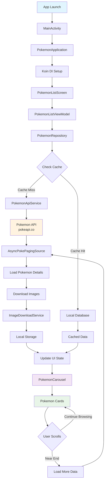

# Pokemon Compose App 🎮

A modern Android application built with Jetpack Compose that displays Pokemon information in a
beautiful Material Design carousel. The app follows Clean Architecture principles and MVVM pattern,
featuring efficient data loading with Paging 3 and offline caching capabilities.

## ✨ Features

- **Material Design Carousel**: Beautiful horizontal pager with smooth Pokemon cards
- **Auto-pagination**: Infinite scrolling with automatic data loading
- **Offline Support**: Local caching with image downloads for offline usage
- **Type-based Theming**: Dynamic colors based on Pokemon types
- **Error Handling**: Graceful error states and recovery mechanisms
- **Loading States**: Proper loading indicators for better UX
- **High-quality Images**: Official Pokemon artwork with fallback support

## 🏗️ Architecture

This project implements **Clean Architecture** with **MVVM** pattern:

### Architecture Layers

1. **Presentation Layer** (`presentation/`)
    - ViewModels managing UI state
    - Compose UI components and screens
    - Navigation with Voyager

2. **Domain Layer** (`domain/`)
    - Business models and entities
    - Repository interfaces

3. **Data Layer** (`data/`)
    - Repository implementations
    - Remote API services
    - Local database with Room
    - Data mappers and DTOs

### SOLID Principles Applied

- ✅ **Single Responsibility**: Each class has one clear purpose
- ✅ **Open/Closed**: Repository interface allows different implementations
- ✅ **Liskov Substitution**: Repository implementations maintain contract
- ✅ **Interface Segregation**: Clean, focused interfaces
- ✅ **Dependency Inversion**: High-level modules depend on abstractions

### Core Technologies

- **Kotlin** - Primary programming language
- **Jetpack Compose** - Modern declarative UI framework
- **Material 3** - Google's latest design system

### Architecture & DI

- **MVVM** - Presentation architecture pattern
- **Koin** - Lightweight dependency injection framework
- **Voyager** - Type-safe navigation library

### Data & Networking

- **Retrofit** - HTTP client for API calls
- **Gson** - JSON serialization/deserialization
- **Room** - Local SQLite database abstraction
- **Paging 3** - Efficient data loading and pagination

### Image Loading & Caching

- **Coil** - Image loading library with caching
- **Custom Image Downloader** - Local image caching system

### Async & Reactive

- **Kotlin Coroutines** - Asynchronous programming
- **Flow** - Reactive stream processing

## 🎯 Project Structure

```
pokemon-compose/
├── src/main/java/com/example/pokemon_compose/
│   ├── data/
│   │   ├── mapper/           # DTO to Domain mapping
│   │   ├── remote/          # API services & paging
│   │   └── repository/      # Repository implementation
│   ├── di/
│   │   └── AppModule.kt     # Dependency injection setup
│   ├── domain/
│   │   └── model/           # Domain models
│   ├── presentation/
│   │   ├── pokemonlistscreen/
│   │   │   ├── components/  # Reusable UI components
│   │   │   └── PokemonListScreen.kt
│   │   └── viewmodel/       # ViewModels
│   ├── ui/theme/            # App theming
│   └── PokemonApplication.kt
└── build.gradle.kts         # Module dependencies
```

## 📱 App Flow Diagram

